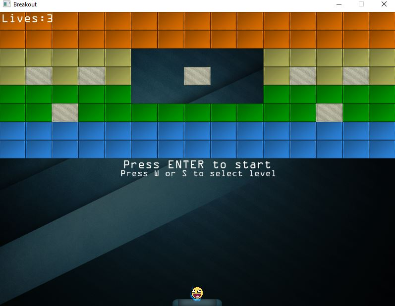

## Introduction

This is **bold** text, and this is *emphasized* text.

Developed A 2D Brick Breaker using OpenGL Framework. This was my first project with OpenGL api and was quite pleased with the final result

https://github.com/kanand003/BrickBreaker

<!-- Debug Image Tests -->
1. Absolute path with Website:

2. Absolute path without Website:

3. Relative path:

4. Direct URL:

<!-- Original photo comment -->
<!--Add photo -->