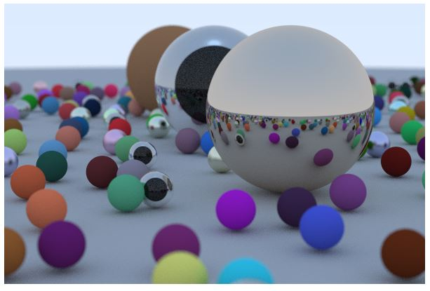

## Introduction

Made a ray tracer over a weekend. Was quite happy with the final results.

https://github.com/kanand003/RayTracerWeekend

<!-- Debug Image Tests -->
1. Absolute path with Website:

2. Absolute path without Website:

3. Relative path:

4. Direct URL:

<!--Add photo -->

## Showcase Video
